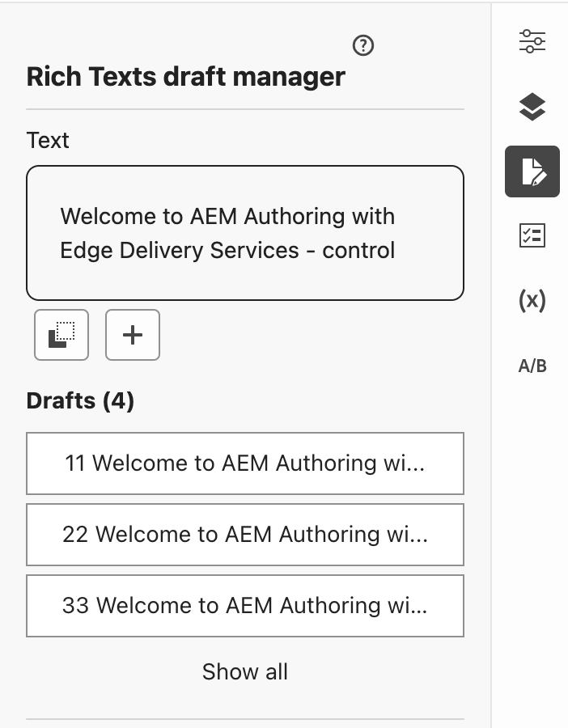

# Content Drafts

## Universal Editor Extensibility
This extension is an example of extending the Universal Editor with custom functionality.
The Universal Editor is a headless content management system that allows users to create, manage, and publish content across multiple channels. It provides core features that are extendable with custom functionality using extensions.

### Documentation
In this link, you can find the documentation of the UI extensibility: [UIExtensibility Documentation](https://developer.adobe.com/uix/docs)

To get more information about the universal editor extension points, please refer to the [Universal Editor Extension Points](https://developer.adobe.com/uix/docs/services/aem-universal-editor/) documentation.
## Functionality

The `universal-editor-richtext-draft` extension provides a rich text editor with draft management capabilities. It allows users to create, edit, and manage multiple drafts of their content of type `reachtext` directly within the editor.



### Features

- **Rich Text Editing**: The extension provides a rich text editor where users can edit and format their text.

- **Draft Management**: Users can create multiple content drafts. Each draft is saved separately, allowing users to easily switch between different versions of their content.

- **Draft Actions**: For each draft, users can perform several actions, including editing it, adding a new draft, applying it, and deleting it.

Please refer to the `src/universal-editor-ui-1/web-src/src/components` file for the implementation details.

### How to use
After enabling the extension in the Universal Editor, you should see the extension in the rail panel as follows:


- Start by clicking Create draft from content text or create an empty draft.
- In the draft text make the changes you want and select the option you need (save draft, apply the draft or cancel the creation of the draft).
- For a created draft, you can manage it by clicking in it. Options available are to edit it, save the edition, apply the draft, or delete the draft.
- By default, you will see three drafts. If you have more, click 'Show all' to see all the rest.

The drafts are persisted on the browser. If you clear the cache, you will lose them.
The minimum length of a draft is `50` characters.

## Setup

- Populate the `.env` file in the project root and fill it as shown [below](#env)

## Local Dev

- `aio app run` to start your local Dev server
- App will run on `localhost:9080` by default

By default the UI will be served locally but actions will be deployed and served from Adobe I/O Runtime. To start a
local serverless stack and also run your actions locally use the `aio app run --local` option.

## Test & Coverage

- Run `aio app test` to run unit tests for ui and actions
- Run `aio app test --e2e` to run e2e tests

## Deploy & Cleanup

- `aio app deploy` to build and deploy all actions on Runtime and static files to CDN
- `aio app undeploy` to undeploy the app

## Config

### `.env`

You can generate this file using the command `aio app use`. 
Add this line to the generated .env file
```bash
UNIVERSAL_EDITOR_URL=https://universal-editor-service.experiencecloud.live
```

```bash
# This file must **not** be committed to source control

## please provide your Adobe I/O Runtime credentials
# AIO_RUNTIME_AUTH=
# AIO_RUNTIME_NAMESPACE=
```

### `app.config.yaml`

- Main configuration file that defines an application's implementation. 
- More information on this file, application configuration, and extension configuration 
  can be found [here](https://developer.adobe.com/app-builder/docs/guides/appbuilder-configuration/#appconfigyaml)

#### Action Dependencies

- You have two options to resolve your actions' dependencies:

  1. **Packaged action file**: Add your action's dependencies to the root
   `package.json` and install them using `npm install`. Then set the `function`
   field in `app.config.yaml` to point to the **entry file** of your action
   folder. We will use `webpack` to package your code and dependencies into a
   single minified js file. The action will then be deployed as a single file.
   Use this method if you want to reduce the size of your actions.

  2. **Zipped action folder**: In the folder containing the action code add a
     `package.json` with the action's dependencies. Then set the `function`
     field in `app.config.yaml` to point to the **folder** of that action. We will
     install the required dependencies within that directory and zip the folder
     before deploying it as a zipped action. Use this method if you want to keep
     your action's dependencies separated.

## Debugging in VS Code

While running your local server (`aio app run`), both UI and actions can be debugged, to do so open the vscode debugger
and select the debugging configuration called `WebAndActions`.
Alternatively, there are also debug configs for only UI and each separate action.

## Typescript support for UI

To use typescript use `.tsx` extension for react components and add a `tsconfig.json` 
and make sure you have the below config added
```
 {
  "compilerOptions": {
      "jsx": "react"
    }
  } 
```
